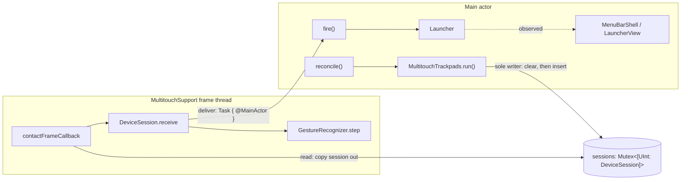

# How: touches to a fired gesture, activity, the shell and the tests

Produced by the `how` skill (four explorers, one explainer) on 2026-10-09 against branch `feature/001-trackpad-launcher-app` at 7c7f7c2. Line numbers refer to that commit.

## Overview

Trackpad Launcher turns a "thumb resting in a top corner, quick tap with 1 to 4 fingers" pattern into an app launch. Raw contact frames come from the private MultitouchSupport framework on its own background thread. Each trackpad has one `GestureRecognizer`, a pure struct that steps once per frame and occasionally returns a `Gesture`. That gesture hops to the main actor. There, `Launcher.fire` decides whether it counts: gestures must be active, the gesture must have an assignment, and the app must still exist. If it counts, `fire` plays a haptic, brings the app to front and closes the window.

Whether gestures are active is derived, never stored. A connected trackpad is required, and neither "Tap to click" nor "Look up with three fingers" may be on. That one fact is enforced in two places. `reconcile()` starts no devices while inactive, so the recognizer never even sees frames, and `fire` re-checks it to drop gestures that were already in flight. The UI (`MenuBarShell` plus SwiftUI views) only observes `Launcher`. Tests drive the real `Launcher` and the real recognizer through in-memory adapters, using a frame builder (`TouchScript`) and hand-built frames (`HandFrames`). A source-scanning test (`SourcePolicyTests`) bans timers, polling and permission APIs, including every API plan 002 names.

## Key Concepts

- **`TouchFrame`** (`LauncherCore/Touch.swift:43`): a complete snapshot of one instant on one trackpad. It holds `time: FrameTime`, `touches: [Touch]` (only contacts that are down) and `buttonDown: Bool`. A contact missing from `touches` has lifted.
- **`Touch`**: `id: TouchID` (Int32 from the driver), `phase: .landing | .down`, and `position: SurfacePoint` (normalised, top-left origin).
- **`FrameTime`** (`Touch.swift:29`): seconds as a `Double` on the driver's clock. It is "the only time recognition ever reads." It is not `Comparable`. The only operator is `-`, which returns a `Duration`.
- **`GestureRecognizer`** (`LauncherCore/GestureRecognizer.swift`): a value-type state machine for one trackpad. Its whole API is `init(handMode:surface:)` and `mutating step(_:) -> Gesture?`.
- **`GestureRules`** (`LauncherCore/GestureRules.swift`): corner zone 0.20 wide by 0.25 high (normalised), anchor release margin 2 mm, `maxTapDuration` 300 ms, `dragThresholdMM` 3 mm. It is a `package` enum with internal members, so tests can't read it and hardcode the numbers instead.
- **`AnchorCorner`** (`LauncherCore/Surface.swift:32-56`): `admits(p)` is the strict zone and is used to adopt a thumb. `holds(p)` is the zone plus 2 mm and is used to keep it. `fromEdge` is `p.x` in right-hand mode and `1 - p.x` in left-hand mode. On the MacBook 14 surface (124.8 × 76.8 mm) that means adopt below about 24.96 × 19.2 mm and keep below about 26.96 × 21.2 mm.
- **`Gesture` / `GestureEvent`** (`LauncherCore/Gesture.swift`): `Gesture(fingerCount:)` returns nil outside 1...4. `GestureEvent` adds the `TrackpadID`, which `DeviceSession` attaches; the recognizer never knows it.
- **Ports** (`LauncherCore/Ports.swift`): `TrackpadHardware`, `TrackpadPreferences` and `SystemActions`, all `@MainActor`. Each port has exactly two adapters: the real one in `LauncherPlatform` and an in-memory one in tests (`docs/architecture.md:14`).
- **`GestureActivity`** (`LauncherCore/Activity.swift:55-71`): `.active`, or `.inactive(.noTrackpad | .settings(ConflictingSettings))`. It is a pure function of the connected trackpad kinds and the preference values. "No trackpad" wins over settings.
- **`DeviceSession` / `sessions`** (`LauncherPlatform/FrameStream.swift`): a session is one running trackpad (ID, `Mutex<GestureRecognizer>`, `deliver` closure). `sessions` is the module-level `Mutex<[UInt: DeviceSession]>` registry, and it is the only state shared between main and the frame thread.

## How It Works

### Threads and who owns what



There are two ownership rules:

- **`sessions` has one writer.** `MultitouchTrackpads.run`, on main, is the only writer. The frame callback only reads it.
- **Each recognizer is owned by one device's callbacks.** The `Mutex` around it is described as "the compiler's proof" of that ownership and "never contended" (`FrameStream.swift:5-6`).

`nonisolated(unsafe)` is banned by policy. A module-level `let` holding a `Mutex` is therefore the established pattern for anything shared with a non-main thread.

The two explorers seemed to disagree about in-flight frames. The `FrameStream.swift:26-27` comment says a frame for a torn-down device "finds nothing and is dropped". That is true if the lookup happens after `run` clears the registry. But the callback copies the session reference out and releases the lock before stepping (`:31-32`). A frame whose lookup ran just before the clear can therefore still step the old recognizer and deliver a stale gesture. That is why `Launcher.fire` re-checks `activity.isActive`, and `InMemoryTrackpads.inject` exists to test exactly this (`ActivityTests.gestureInFlightWhenActivityFlipsIsDropped`).

### From touches to a gesture

1. **Devices start (main).** `Launcher.reconcile()` (`Launcher.swift:91-95`) calls `hardware.run(activity.isActive ? connected : [], handMode:)`. `MultitouchTrackpads.run` (`MultitouchTrackpads.swift:62-93`) works in this order:
   - It empties `sessions`.
   - It unregisters callbacks and stops every started device, then closes the actuators.
   - For each wanted trackpad it builds a `DeviceSession` with a **fresh** `GestureRecognizer`. The `deliver` closure is `Task { @MainActor in self?.onEvent?(.gesture(event)) }`.
   - It opens the haptic actuator, inserts the session, registers `contactFrameCallback` and starts the device.

   `run([])` stops everything, so inactive really means no frames arrive.
2. **A frame arrives (frame thread).** `contactFrameCallback` (`FrameStream.swift:30-35`) looks up the session by the device pointer's bit pattern and drops the frame if there is none. It then builds `TouchFrame(parsing:count:timestamp:buttonDown: anyMouseButtonDown())`. `anyMouseButtonDown()` (`:38-40`) is a state query, not an event tap. It checks left, right and center buttons via `CGEventSource.buttonState(.combinedSessionState, …)`. It is sampled when the callback runs, and it merges every source, so a mouse in the other hand counts too.
3. **Parse.** `TouchFrame.init(parsing:)` (`LauncherPlatform/TouchFrameParsing.swift:40-55`) reads 96-byte `MTTouchMirror` records. It keeps only driver state 3 (MakeTouch, mapped to `.landing`) and 4 (Touching, mapped to `.down`), and flips y. Time comes from the callback's `timestamp` argument, not from the per-touch timestamp.
4. **Step.** `DeviceSession.receive` runs `recognizer.withLock { $0.step(frame) }`. If a gesture comes back, it wraps it with the trackpad ID and calls `deliver`.
5. **Hop and fire (main).** `Launcher.start` set `onEvent` so that `.gesture` calls `fire`. `fire` (`Launcher.swift:98-106`) silently drops the gesture unless activity is active, an assignment exists and `catalog.locate` finds the app. Otherwise it calls `playFeedback(on:)` (actuation 6 on main), `bringToFront`, and sets `isWindowOpen = false`.

   The haptic therefore plays after an asynchronous main-actor hop, not on the frame thread. Each gesture becomes its own unstructured `Task`, and nobody has checked whether two such tasks run in order.

### The recognizer state machine (exact rules)

The recognizer stores four things: `corner`, `surface`, `state` and `previouslyDown: Set<TouchID>`. `Anchor` holds only `id`, with **no timestamp**.

```
           thumb lands in corner                    first non-anchor finger lands
  idle ─────────────────────────► armed ───────────────────────────────────────► tapping
   ▲      (alone → armed,           ▲  │ (with buttonDown → spoiled)               │
   │       others down → spoiled)   │  ▼                                           │
   │                              spoiled ◄── button / >300 ms / drag >3 mm ───────┤
   │                                 │ only the anchor is down → armed             │
   │                                                                               │
   │                                 all tracked fingers gone: FIRE Gesture(peak), │
   │                                 then armed (or tapping, if fingers landed     │
   │                                 in this same frame)                           │
   └── anchor lifted / reused / outside `holds` (checked first, every frame) ──────┘
```

**Per-frame derivations** (`GestureRecognizer.swift:13-17`):
- `down` maps ID to touch. If an ID appears twice, the first one wins.
- `reused` is the set of IDs that arrive with `.landing` but were already in `previouslyDown`. These are driver-reused IDs: the contact lifted and landed again between frames.
- `lifted` is `(previouslyDown − down) ∪ reused`.
- `landed` is an ordered array of touches with `.landing`, or not previously down.
- `previouslyDown` is updated in a `defer`.

**Anchor drop runs before the switch** (`:19-22`). If an anchor exists and has lifted, been reused, or is no longer within `holds`, the state becomes `.idle`. The switch then runs as `.idle` in the same frame, so a thumb re-landing in the corner is adopted at once. A tap in progress is discarded without firing.

**`.idle`** (`:26-30`): adopts the first `landed` touch inside `admits`. If it is the only contact down, the state becomes `.armed`; otherwise it becomes `.spoiled`. Only landed contacts are adopted, so a contact that slides into the corner is never picked up.

**`.armed`** (`:31-35`): if any non-anchor touches landed this frame, the state becomes `.spoiled` when `buttonDown` is true. Otherwise it becomes `.tapping` with each finger's landing point, `peak = landed.count` and `start = frame.time`.

**`.tapping`** (`:36-54`), in this order:
1. Remove lifted IDs from `fingers`.
2. **Spoil** if `buttonDown`, or `frame.time - start > 300 ms` (strictly greater), or any finger that is still down is more than 3 mm from its landing point.
3. Otherwise, **fire** if `fingers` is now empty: `Gesture(fingerCount: peak)`, which is nil when peak > 4. Fingers that landed in this same frame start the next tap immediately, with `start` set to now. If none landed, the state goes back to `.armed`.
4. Otherwise, add the newly landed non-anchor touches, overwriting reused IDs with their new origin, and set `peak = max(peak, fingers.count)`.

Because the spoil checks come before the fire check, a press or a timeout on the very frame the last finger lifts prevents the fire.

**`.spoiled`** (`:55-58`): returns to `.armed` on the first frame where only the anchor is down. It does **not** check `buttonDown`.

**Timing.** A tap starts on the frame where the first finger appears in `landed`. It ends on the first frame where the tracked set is empty, which is the lift-detection frame. Frames arrive about every 8 to 11 ms (sourced from documentation, not measured), so the effective limit is about 300 ms plus up to one frame interval.

**The finger count is a peak of simultaneous fingers, not a count of distinct fingers.** Lifted fingers are removed before new ones are added. Suppose fingers 1, 2 and 3 are down, and finger 1 lifts in the same frame finger 4 lands. That fires `.three`; this is plan 002's R1 bug. A rolling five-finger tap that never has more than four fingers down at once fires `.four` or fewer. With `TouchScript` (5 fingers, stagger 40, hold 100) it fires `.three`, where R1 says nothing should fire.

**What the recognizer knows and doesn't.** It knows frame time, the touches that are down (ID, phase, position), `buttonDown`, the hand mode and the surface size. It does not know:
- any wall clock, and it has no timers;
- the trackpad's ID;
- whether a press came from the trackpad or a mouse, or whether it was blocked;
- when the anchor was adopted.

Its only output is `Gesture?`. The only code that has both the step result and the session is `DeviceSession.receive`, and its only way out is `deliver`, which is always an asynchronous hop to main.

### The Launcher model: activity, reconcile and fire

`Launcher` (`LauncherCore/Launcher.swift`) is `@MainActor @Observable`. Its fields:

- **Observed, stored:** `rows`, `isWindowOpen`, `settings` (private), `connected` (private), `preferenceValues` (private).
- **Computed:** `handMode` (passes through to `settings`) and `activity`, which is computed from `connected` and `preferenceValues`. Observation tracks it through those two stored fields.
- **Not observed:** `isFirstLaunch` (true when `store.load()` returned nil, frozen at `init`), plus the port and store references, all `@ObservationIgnored let`.

**`start()`** (`:43-57`) wires the callbacks:
- `hardware.onEvent`: `.gesture` calls `fire`, and `.trackpadsChanged` calls `reconcile`.
- `preferences.onChange` calls `reconcile`.

It then calls `reconcile()`. On first launch only, it calls `registerLoginItem()`, then `store.save(settings)`, then `openWindow()`. The login item comes before the save on purpose: a crash in between registers it again next time instead of losing it.

**`reconcile()`** (`:91-95`) is "the one convergent operation." It re-reads `hardware.connected()` and `preferences.current()` into the stored fields, then calls `hardware.run(...)`. It runs on four triggers: `start()`, `.trackpadsChanged` (attach, detach, wake), a preference change, and `setHandMode`. **It does not diff.** Every trigger tears down every device and creates fresh recognizers.

**The port pattern** is the template for new live facts. Each sensing port has:
- a main-actor callback that carries no data and only means "re-read" (`onEvent` / `onChange`);
- a synchronous, fresh-read method (`connected()` / `current()`).

The real adapters turn OS pushes into those callbacks:
- **IOKit hot-plug:** an `IONotificationPort` on `.main` for `AppleMultitouchDevice` first-match and terminated events. It hops with `MainActor.assumeIsolated`.
- **Wake:** an `NSWorkspace.didWakeNotification` observer on `.main`.
- **cfprefs:** KVO on the two trackpad preference suites (`SystemTrackpadPreferences`). `observeValue` is `nonisolated` and hops with `Task { @MainActor }`.

Nothing polls. Pushes that arrive before `start()` hit a nil callback and are dropped. That is harmless only because `start()` reconciles from fresh reads.

**Settings** (`LauncherCore/Settings.swift`) holds only `handMode` and `assignments`, stored as one binary-plist key. `load()` returns nil only when nothing is stored. Undecodable data loads as default `Settings()` and does not count as a first launch.

**Composition root** (`TrackpadLauncher/TrackpadLauncherApp.swift:8-20`), in order:
1. Build the adapters. Their inits already register the IOKit, wake and KVO observers.
2. Build `Launcher`.
3. Build `MenuBarShell`. It must exist before `start()`, because the first-launch window anchors to the status item.
4. Call `launcher.start()`.
5. Run `application.run()` inside `withExtendedLifetime(shell)`.

### The shell: observation and refit

`MenuBarShell` (`LauncherKit/Sources/LauncherUI/MenuBarShell.swift`) is LauncherUI's only public type. LauncherUI depends on LauncherCore only, never on LauncherPlatform.

In `init` (`:20-51`) it:
- builds the `LauncherPanel` around `LauncherView` once;
- sets the icon from `launcher.activity.isActive`;
- wires the status button so it calls `launcher.openWindow()` / `closeWindow()`. The shell never shows or hides the panel directly;
- sets Escape and resign-key to call `closeWindow`;
- starts two `Observations` loops:
  - `{ launcher.activity.isActive }` updates the icon and calls `refit()` (`:38-44`).
  - `{ launcher.isWindowOpen }` calls `show()` or `hide()` (`:45-50`).

`show()` calls `refit()`, orders the panel front and installs a global mouse-down monitor that closes the window. `hide()` removes the monitor and orders the panel out.

**Refit is not automatic.** `LauncherView` has a fixed width (266) and a height that depends on its content. The panel's frame is set only in `LauncherPanel.fitToContent` (`LauncherPanel.swift:63-68`), from `hosting.fittingSize`. That happens only through `refit()`, which has exactly three callers:
- the status window's `didMoveNotification`;
- the `activity.isActive` loop;
- `show()`.

Any new observed property that changes the view's height while the window is open gets **no refit** unless a loop reads it. Two details about the existing loop:
- It fires more often than its name suggests. `Observations` does not de-duplicate, so any real change to `connected` or `preferenceValues` re-emits even when `isActive` stays the same.
- Both loops emit their initial value asynchronously after `init`. That first refit is a no-op because the window is not open yet.

**View structure.** `LauncherView.body` (`LauncherView.swift:11-42`) contains, in an inner `VStack(spacing: 16)`:
1. the gesture rows;
2. `HandModeToggle`;
3. `Divider`;
4. `switch launcher.activity`: `HintText` when active, `TrackpadSettingsNotice(cause:openSettings:)` when inactive.

A Quit button sits below that stack. `TrackpadSettingsNotice` (`:126-149`) is the existing "hint plus a System Settings button" pattern. Its button calls `LauncherActions.openTrackpadSettings`, which opens `x-apple.systempreferences:com.apple.preference.trackpad` via `NSWorkspace`. Opening Settings from the shell, not the model, was a deliberate 001 decision. The `hintStyle()` modifier is `private` to that file.

The icon reads only `activity.isActive`. Any fact kept out of `GestureActivity` leaves the icon unchanged.

### Test seams and what the fixtures can express

**`World`** (`Tests/LauncherCoreTests/World.swift`) builds the real `Launcher` over:
- `InMemoryTrackpads`;
- `InMemoryTrackpadPreferences`;
- `RecordingSystemActions`;
- a temp folder of fake `.app` bundles;
- a throwaway `UserDefaults` suite.

It does not call `start()`. `relaunch()` builds a new `Launcher` over the same adapters and store suite. The `Launcher(...)` constructor call appears three times (`World.swift:55-56`, `:113-114`, and `TrackpadLauncherApp.swift`), so a new port means editing all three, plus adding a fake in `InMemoryAdapters.swift`.

**`InMemoryTrackpads`** (`InMemoryAdapters.swift:4-54`) steps the **real** recognizer synchronously on main and calls `onEvent` inline, so tests act and then assert with no waiting. That differs from the real adapter's asynchronous hop. Its methods:
- `run` replaces every recognizer with a fresh one. A `preferences.set(...)` in the middle of a script therefore resets anchor and tap state, exactly like production.
- `touch(_:on:)` stops at the first frame where the trackpad is not running or is `deaf` (after `sleep()`).
- `inject` delivers a gesture regardless of the `running` state.

**`TouchScript`** (`TouchScript.swift`) is a left-to-right timeline builder:
- Frames are 10 ms apart, and frame time is `1.0 + ms/1000`.
- The thumb has ID 100. Fingers get IDs 1, 2, 3… and are never reused.
- A contact is included while `landMS <= ms < liftMS`. It is `.landing` only on its land frame.
- `buttonDown` is true when `ms` falls inside any `presses` range.

`tap(fingers:atMM:stagger:hold:dragMM:click:)` places fingers 8 mm apart. Each finger lifts at `land + hold`. `.onLanding` presses span `start...lastLift`, and `.midway` presses span `(start + hold/2)...lastLift`. **Both press ranges include the lift frame, where the fingers are already gone** and only the thumb is down. The cursor then advances 100 ms.

It **can** express:
- a finger lifting before a later one lands, which reproduces R1's bug;
- rolling 5-finger taps;
- two quick taps with a gap of 100 ms or more;
- a thumb resting for 3 s or more before a tap (`wait`);
- a press around the 3-second mark;
- a same-frame handover (`stagger == hold`), which fires `.one` repeatedly.

It **cannot** express:
- a different stagger or hold per finger;
- a finger bouncing within a tap, because each contact has one land/lift and IDs are fresh;
- a thumb-only press;
- a press that starts before the thumb lands;
- a press that ends before or after the last-lift frame;
- a gap under 100 ms between taps;
- timing finer than 10 ms;
- a second anchoring, because `liftThumb` / `rollThumb` only modify the first thumb contact.

**`HandFrames`** (`Fixtures.swift:31-45`) can express all of those: sparse frames, reused IDs with `.landing`, arbitrary times and presses. The 001 log chose hand-built frames over extending the builder (`development-logs.md:49`). The per-frame `step` map in `reusedTouchIDLandingAgainStartsASecondTap` is the only existing way to assert which frame a gesture fires on.

**`World.tap`** restarts frame time at 1.0 s on every call, while the recognizer in `running` persists. The thumb (ID 100) arrives with `.landing` on an ID that is already down. The recognizer reads that as a reuse, drops the anchor and re-adopts it in the same frame. That re-anchoring currently hides the fact that time goes backwards between calls.

**Tests that encode the current rules:**
- `GestureRecognizerTests`:
  - corner x 10/40;
  - zone edges 24/26 and 18/20;
  - drag 2.5/3.5;
  - hold 290/310 (`tapLongerThanThreeHundredMillisecondsIsNotATap`, `:150-154`);
  - thumb roll 26.5/28.0;
  - `physicalClickIsNotATapAndTheNextTapStillFires` (`:143-148`), where a press always cancels;
  - `fingerCountIsThePeakNotTheCountAtTheLastLift` (`:97-101`), which gives 3 under either counting rule but whose name describes the peak rule;
  - `reusedTouchIDLandingAgainStartsASecondTap` (`:163-178`), which expects `[nil, nil, nil, nil, .one, nil, nil, .one]`.
- `LauncherTests`, `ActivityTests` and `PersistenceTests` drive the model through `World`.
- `LauncherPlatformTests` covers frame parsing, trackpad classification, and the real preference KVO push. That last test waits on an `AsyncStream` and uses a 5 s `Task.sleep` only as a bound, which is allowed because tests aren't scanned.
- There is **no LauncherUI test target**. The shell and views are verified by hand.

`Scripts/test.sh` runs `swift test` in `LauncherKit`. Explorer 4 ran it: 67 tests in 11 suites passed in about 1.3 s.

### Policy gates

`SourcePolicyTests.banned` (`SourcePolicyTests.swift:13-41`) is a case-sensitive **substring match on every line**, comments and string literals included. It scans `LauncherKit/Sources` and `TrackpadLauncher/`, never tests. The banned tokens:

| Rule | Tokens |
|---|---|
| timer | `Timer`, `asyncAfter`, `makeTimerSource` |
| polling | `Task.sleep` |
| permission | `AXIsProcessTrusted`, `tapCreate`, `CGEventTapCreate`, `IOHIDManager`, `CGRequestListenEventAccess`, `CGPreflightListenEventAccess` |
| one writer per field | `nonisolated(unsafe)` |
| log, network, own files | `print(`, `NSLog(`, `URLSession`, `.write(to:`, … |

Self-checks keep the scanner honest:
- `scannerFindsAPlantedHit` requires exactly one hit across all tokens on a planted file. A token that matches the planted file's other lines breaks it.
- `scanVisitsEveryLibraryTarget` checks that every library target is scanned.
- `coreImportsOnlyFoundationAndObservation` keeps AppKit and ApplicationServices out of LauncherCore.

The prose rules match the scanner: `docs/architecture.md:19` says "no timers, no polling", `:22` says "The app asks for no permission", and `:23` says to add to the list rather than write prose. `project.yml` generates an Info.plist with no usage-description keys and there are no entitlements. Hardened runtime is on, signing is manual with team `CQK27876UL`, and the app is not sandboxed. `docs/domain-model.md:59-60` already defines "Accessibility hint".

## Where Things Live

All paths are under `/Users/dominykasgrubys/code/trackpad-launcher/.claude/worktrees/001-trackpad-launcher-app/`.

- `LauncherKit/Sources/LauncherCore/`
  - `GestureRecognizer.swift`, `GestureRules.swift`, `Surface.swift`, `Touch.swift`, `Gesture.swift`: the recognizer and its inputs.
  - `Launcher.swift`, `Activity.swift`, `Ports.swift`, `Settings.swift`: the model, activity, ports and persistence.
- `LauncherKit/Sources/LauncherPlatform/`
  - `MultitouchTrackpads.swift`: `run`, hot-plug, wake, haptics.
  - `FrameStream.swift`: sessions, the callback, `anyMouseButtonDown`.
  - `TouchFrameParsing.swift`, `MultitouchSupport.swift`: the frame layout and the dlopen'd framework.
  - `SystemTrackpadPreferences.swift`, `WorkspaceActions.swift`: the other real adapters.
- `LauncherKit/Sources/LauncherUI/`
  - `MenuBarShell.swift`: observation loops, `refit`, `makeActions`.
  - `LauncherPanel.swift`: `fitToContent`.
  - `LauncherView.swift`: the views and `hintStyle`.
  - `StatusIcon.swift`, `LauncherActions.swift`.
- `LauncherKit/Tests/LauncherCoreTests/`
  - `World.swift`, `InMemoryAdapters.swift`, `TouchScript.swift`, `Fixtures.swift`: the test harness.
  - `GestureRecognizerTests.swift`, `LauncherTests.swift`, `ActivityTests.swift`, `PersistenceTests.swift`, `SourcePolicyTests.swift`: the suites.
- `LauncherKit/Tests/LauncherPlatformTests/`: parsing, classification, preference KVO.
- `TrackpadLauncher/TrackpadLauncherApp.swift`: the composition root.
- `docs/architecture.md`, `docs/domain-model.md`, `project.yml`, `Config/Base.xcconfig`, `Scripts/test.sh`.

## Gotchas

Things in the current code that plan 002 has to account for:

**Recognizer**
- **Every reconcile resets recognition.** A fresh recognizer has an empty `previouslyDown`, so on its first frame every contact counts as "landed". A thumb that is already resting gets adopted again: `.armed`, or `.spoiled` if other contacts are down. That happens after a hand-mode change, hot-plug, wake or preference change. Anything new wired into `reconcile()` will reset anchor and tap state every time it fires, and would restart any "since the anchor" window.
- **A thumb that slides out stays out.** It drops the anchor and is never re-adopted when it slides back. The user must lift it and land it again.
- **A spoil on the lift frame can swallow the next tap.** The state stays `.spoiled` until a frame where only the anchor is down. If a finger lands on the very next frame, that tap is lost.
- **Recovery ignores the button.** `.spoiled` returns to `.armed` while the button is still held. The next finger that lands then spoils again from `.armed`.
- **Reused IDs end a single-finger tap.** A reused-ID re-land fires and starts a new tap, as `reusedTouchIDLandingAgainStartsASecondTap` pins. That conflicts with R1's "a finger that lifts and lands again within the same tap MUST count once" when that finger is the only one down.
- **The initial `peak` counts the array; later updates count the dictionary.** `landed.count` vs `fingers.count`. They differ only if the driver sends duplicate IDs in one frame.
- **The drag check only sees frames where the finger is still down.** Movement between the last frame a finger is seen and its lift is invisible. The thumb is never drag-checked, only checked with `holds`.

**Inputs and timing**
- **`buttonDown` merges every pointing device.** A mouse click in the other hand during a tap spoils it.
- **`FrameTime` subtraction is floating-point.** `1.35 − 1.05` is slightly more than 0.3, so an exactly-300 ms tap built from `TouchScript` times is probably rejected (reasoned, not run). Boundary rows should straddle the limit, as 290/310 do today.

**Model and shell**
- **Two kinds of main-actor hop.** IOKit and wake use the synchronous `MainActor.assumeIsolated`. KVO and gesture delivery use the asynchronous `Task { @MainActor }`. The asynchronous one is why `fire` re-checks activity.
- **`isFirstLaunch` is frozen at `init`** and is not observed.
- **The window probably closes when the user opens System Settings.** The global mouse-down monitor and resign-key both call `closeWindow`, so a permission change usually lands while the window is closed and is handled by `show()`'s refit. A change while the window is open (for example via `tccutil`) is reachable, and today nothing would refit for it.
- **No Accessibility settings URL exists** in the codebase. The only one is the Trackpad pane.
- **`TrackpadSettingsNotice` takes a bare closure**, and its button has no `.controlSize`, unlike Quit's `.large`.

**Tests and policy**
- **Policy substring collisions.**
  - `AXIsProcessTrusted` also matches `AXIsProcessTrustedWithOptions`.
  - `tapCreate` matches `CGEvent.tapCreate(`.
  - `Timer` matches `CFRunLoopTimer`, `DispatchSourceTimer` and any comment containing "Timer".
  - Not currently banned: `CGEvent.tapEnable`, `CGPreflightPostEventAccess`, `IOHIDCheckAccess`/`IOHIDRequestAccess`, `ContinuousClock().sleep`, `perform(_:with:afterDelay:)`, `DistributedNotificationCenter`.
- **`InMemoryTrackpads` has no analogue for a synchronous off-main query.** Something like "should this mouse-down be blocked?" asked from another thread doesn't fit its inline-callback pattern yet.
- **`GestureRules` constants are internal**, so test names and rows embed the literal numbers (290/310 and so on).

## Open Questions

These are explorer gaps, not settled facts.

- **Clock.** Is the callback `timestamp` behind `FrameTime` on the same time base as CGEvent timestamps or `ProcessInfo.systemUptime`? Unchecked.
- **Blocked presses.** Does `CGEventSource.buttonState(.combinedSessionState, …)` still report the button as down when an event tap drops the mouse-down? The probe couldn't run because the process wasn't trusted. R8 ("a blocked press counts as a tap") depends on the answer.
- **Accessibility change notifications.** Is `com.apple.accessibility.api` (or anything else) pushed on grant or revoke, and on which thread? A probe saw 0 notifications, but its `tccutil` call failed, so that isn't a real negative. Today there is no push source for Accessibility trust, and polling and timers are banned.
- **Re-landing finger IDs.** Does the driver reuse the ID (`.landing` on a known ID) or assign a new one? That decides whether "bouncing finger counts once" can be done by counting distinct `TouchID`s.
- **R1 edge cases.** Does a reused-ID `.landing` within one frame (no frame with zero fingers) end a tap? Does a same-frame handover (`stagger == hold`) start a new tap? The spec doesn't say.
- **Threading and ordering.** Does MultitouchSupport use one callback thread per device or a shared thread? Do two quickly fired `Task { @MainActor }` hops run in order? Not probed.
- **First-launch prompt timing.** `AXIsProcessTrustedWithOptions(prompt)` returns immediately, but R10 wants the window open "once the prompt is dismissed". No existing pattern waits on a system prompt; `start()` and `openWindow()` are fully synchronous.
- **Panel sizing.** Does `NSHostingView` inside `NSGlassEffectView` resize the panel by itself when content changes? Is `fittingSize` up to date when `refit()` runs from an `Observations` emission? It apparently works for the activity flip, but it is untested.
- **Accessibility grants across rebuilds.** Probably preserved for rebuilds signed with the same identity, but not verified.
